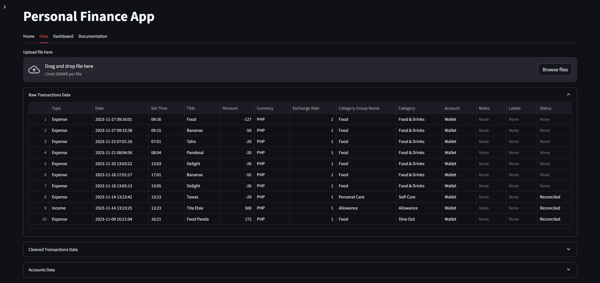
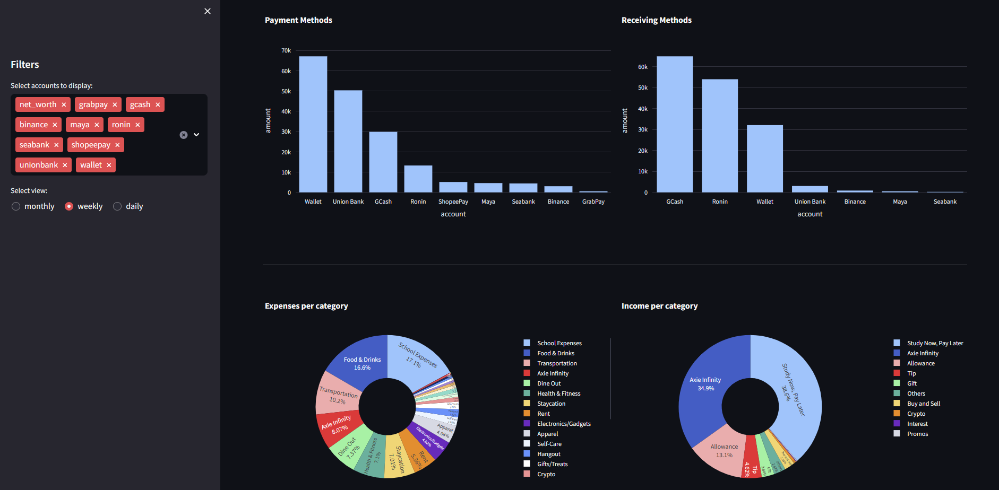
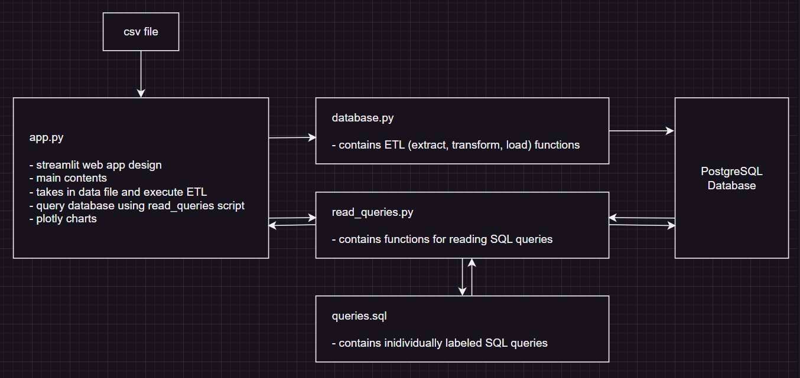

# Personal Finance Dashboard

## Project Overview
The Personal Finance Dashboard extracts expenditure data from Bluecoins and creates a dashboard to aid in budgeting and financial management. 
Bluecoins is an expense tracking app that allows export of data in CSV format. The Personal Finance Dashboard takes this file or 
any other file with the same CSV format to generate analytics.

## Project Snapshots




## Motivation Behind the Project
I’ve been using the Bluecoins app to track my expenses for over a year now, and using my recorded data, I want to gain insights about my expenditure. 
Some of the questions I aim to answer are as follows:

1. Where am I spending the most?
2. What should be my daily, weekly, and monthly budget based on my spending patterns?
3. Where do most of my money come from?
4. What are my most preferred payment and receiving methods?
5. How much money comes in and out of my accounts over time?

In addition, I wanted to apply what I’ve learned in programming so far. This covers Python (Pandas, SQLAlchemy, Plotly, Streamlit), 
SQL (relational databases, how to write queries), Git workflow, project management and documentation.

## Technology


## Architecture



## To Run
1. Clone the repo
```shell
git clone https://github.com/vinzalfaro/personal-finance-dashboard.git
```
2. Build the Docker images using docker-compose:
```bash
docker-compose build
```
3. Run the Docker containers:
```bash
docker-compose up
```
4. Open your browser and go to `localhost:8501`.
